# Pipelines Template v1.0

## Overview

This repository contains a production-ready template for building data pipelines using modern data engineering tools and agentic development methodologies. The template is designed to accelerate the development of data processing systems by providing a standardized framework, proven patterns, and AI-assisted development workflows.

The template demonstrates a complete credit bureau data platform implementation that processes 19,975+ historical files and ongoing data feeds using Apache Spark, Apache Airflow, Apache Iceberg, and PostgreSQL on a single-node architecture with cloud-scale design principles.

## Project Structure & Development Phases

This template follows a structured development approach with clear phases and deliverables:

```mermaid
graph TB
    subgraph "Phase 1: Requirements & Discovery"
        P1_REQ["📋 requirements/<br/>├── business_requirements.md<br/>├── technical_assessment.md<br/>└── data_discovery.md"]
    end

    subgraph "Phase 2: Architecture & Design"
        P2_DES["🏗️ design/<br/>├── architecture.md<br/>├── data_flows.md<br/>├── design_decisions.md<br/>└── implementation_plan.md"]
    end

    subgraph "Phase 3: Development Environment Setup"
        P3_CTX["⚙️ context/<br/>├── system_context.yaml<br/>├── data_context.md<br/>└── technology/"]
        P3_META["📚 meta/<br/>├── framework_evolution_guide.md<br/>├── context_file_standards.md<br/>├── discovery_templates.md<br/>└── framework_changelog.md"]
        P3_STD["📖 standards/<br/>├── development_patterns.md<br/>└── [other standards files]"]
        P3_EX["🔧 examples/<br/>└── [code templates]"]
        P3_SETUP["🛠️ setup-scripts/<br/>└── [environment automation]"]
        P3_CONF["⚙️ configs/<br/>└── [application configuration]"]
    end

    subgraph "Phase 4: Iterative Development"
        P4_TASKS["📝 tasks/<br/>└── [module specifications]"]
        P4_PROG["📊 progress/<br/>├── current_module_status.md<br/>├── project_status.md<br/>├── decisions_log.md<br/>├── next_module_guide.md<br/>└── executed_prompts/"]
        P4_SRC["💻 src/<br/>├── common/<br/>├── discovery/<br/>├── ingestion/<br/>├── transformation/<br/>└── validation/"]
        P4_AIR["🔄 airflow/<br/>└── dags/"]
        P4_GE["✅ great_expectations/<br/>├── expectations/<br/>├── checkpoints/<br/>└── datasources/"]
        P4_TEST["🧪 tests/<br/>├── unit/<br/>├── integration/<br/>└── fixtures/"]
        P4_SCRIPTS["🛠️ scripts/<br/>├── deployment/<br/>├── monitoring/<br/>└── operations/"]
        P4_LOGS["📝 logs/<br/>└── [application logs]"]
    end

    %% Phase Dependencies
    P1_REQ --> P2_DES
    P2_DES --> P3_CTX
    P2_DES --> P3_META
    P2_DES --> P3_STD
    P2_DES --> P3_EX
    P2_DES --> P3_SETUP
    P2_DES --> P3_CONF
    
    %% Phase 3 to Phase 4 Connections
    P3_CTX --> P4_TASKS
    P3_CTX --> P4_SRC
    P3_META --> P4_PROG
    P3_META --> P4_TASKS
    P3_STD --> P4_SRC
    P3_STD --> P4_AIR
    P3_STD --> P4_TEST
    P3_EX --> P4_SRC
    P3_EX --> P4_AIR
    P3_EX --> P4_GE
    P3_SETUP --> P4_GE
    P3_SETUP --> P4_SCRIPTS
    P3_CONF --> P4_SRC
    P3_CONF --> P4_TEST
    
    %% Internal Phase 4 Dependencies
    P4_TASKS --> P4_PROG
    P4_SRC --> P4_TEST
    P4_SRC --> P4_LOGS
    P4_AIR --> P4_LOGS
    P4_GE --> P4_PROG

    %% Styling
    classDef phase1 fill:#e1f5fe
    classDef phase2 fill:#f3e5f5
    classDef phase3 fill:#e8f5e8
    classDef phase4 fill:#fff3e0

    class P1_REQ phase1
    class P2_DES phase2
    class P3_CTX,P3_META,P3_STD,P3_EX,P3_SETUP,P3_CONF phase3
    class P4_TASKS,P4_PROG,P4_SRC,P4_AIR,P4_GE,P4_TEST,P4_SCRIPTS,P4_LOGS phase4
```



## Key Features

### 🤖 Agentic Development Framework
- **AI-Assisted Development**: Structured prompts and context for Claude Code development
- **Framework Evolution**: Self-improving development patterns and standards
- **Task-Driven Architecture**: Modular development with clear specifications
- **Quality Assurance**: Built-in validation and testing patterns

### 🏗️ Modern Data Stack
- **Apache Spark 3.5+**: Distributed data processing with optimized configurations
- **Apache Airflow 3.0**: Workflow orchestration with TaskFlow API
- **Apache Iceberg**: Data lakehouse with JDBC catalog for staging
- **PostgreSQL**: Operational database for clean, validated data
- **Great Expectations**: Comprehensive data quality validation

### 📊 Data Architecture Patterns
- **Dual Storage Strategy**: Iceberg for analytics, PostgreSQL for operations
- **Quality-First Pipeline**: All data validated before operational use
- **Exclusive Processing**: Live OR historical processing for resource optimization
- **Manual Correction Workflow**: Human-in-the-loop data quality management

### 🔧 Production-Ready Features
- **Configuration Profiles**: Environment-specific Spark and database configurations
- **Error Handling**: Comprehensive logging and recovery mechanisms
- **Resource Optimization**: Single-node to cloud-scale architecture patterns
- **Template Portability**: Easy deployment across different environments

## Repository Structure

```
pipelines/
├── agent-prompts/                    # 🤖 Agentic development framework
│   ├── requirements/                 # Business and technical requirements
│   ├── design/                       # Architecture and data flow designs
│   ├── context/                      # Development context and technology guides
│   │   ├── technology/              # Technology-specific guides (Airflow 3.0, Spark, etc.)
│   │   ├── example_system_context.yaml
│   │   └── example_data_context.md
│   ├── tasks/                        # Module development specifications
│   ├── meta/                         # Framework governance and evolution
│   ├── progress/                     # Development tracking and decisions
│   ├── examples/                     # Code templates and patterns
│   └── standards/                    # Development standards and best practices
├── airflow/                          # 🔄 Workflow orchestration
│   └── dags/                         # Airflow DAG definitions
├── src/                              # 💻 Core application code
│   ├── common/                       # Shared utilities and factories
│   ├── discovery/                    # File discovery and cataloging
│   └── [other modules]/              # Additional processing modules
├── spark/                            # ⚙️ Spark configurations
│   └── configs/                      # Environment-specific configurations
├── great_expectations/               # ✅ Data quality framework
├── tests/                            # 🧪 Testing suite
├── scripts/                          # 🛠️ Utility and operations scripts
├── docs/                             # 📚 Documentation
│   ├── data_architecture/           # Architecture documentation
│   └── dictionaries/                # Data dictionaries and schemas
├── samples/                          # 📁 Sample data files
└── .project-setup/                  # 🔧 Manual configuration guides
```

## Quick Start

### Prerequisites
- Python 3.9+
- Apache Spark 3.5+
- Apache Airflow 3.0
- PostgreSQL 16+
- Java 11+ (for Spark)

### 1. Environment Setup
```bash
# Clone the template
git clone <repository-url>
cd pipelines

# Set up Python virtual environment
python -m venv venv
source venv/bin/activate
pip install -r requirements.txt
```

### 2. Configuration
Follow the manual configuration guides in `.project-setup/`:
- `example_airflow_dag_bundle_config.md` - Airflow DAG discovery
- `example_postgresql_connection_config.md` - Database setup
- `example_system_integration_checklist.md` - Full system validation

### 3. Development Workflow
```bash
# Start with the agentic framework
cd agent-prompts

# Review existing examples and context
cat context/example_system_context.yaml
cat design/example_architecture.md

# Follow the development patterns
cat standards/example_core_development_patterns.md
```

## Usage Examples

### Creating a Spark Session
```python
from src.common.spark_factory import CBSparkSessionFactory

# Create Iceberg-enabled session for data lake operations
spark = CBSparkSessionFactory.create_iceberg_session("MyApp")

# Create historical processing session with maximum resources
spark = CBSparkSessionFactory.create_historical_session("HistoricalLoader")
```

### File Discovery Pipeline
```python
# Example from the implemented discovery module
from src.discovery.historical_file_discovery import HistoricalFileDiscovery

discovery = HistoricalFileDiscovery(
    source_dir="/data/raw/",
    correlation_id="discover-001"
)
results = discovery.run()
```

### Airflow DAG with TaskFlow API
```python
from airflow.decorators import dag, task
import pendulum

@dag(
    schedule=None,  # Airflow 3.0 syntax
    start_date=pendulum.datetime(2025, 1, 1, tz="UTC"),
    tags=['data-pipeline']
)
def data_processing_dag():
    
    @task.external_python(
        python="/path/to/venv/bin/python",
        expect_airflow=False
    )
    def process_data():
        # Processing logic with virtual environment isolation
        return {"status": "success"}
    
    process_data()

# Create DAG instance
dag_instance = data_processing_dag()
```

## Technology Stack

| Component | Version | Purpose |
|-----------|---------|---------|
| Apache Spark | 3.5+ | Distributed data processing |
| Apache Airflow | 3.0 | Workflow orchestration |
| Apache Iceberg | Latest | Data lakehouse storage |
| PostgreSQL | 16+ | Operational database |
| Great Expectations | Latest | Data quality validation |
| Python | 3.9+ | Primary development language |

## Development Philosophy

### Agentic Development
This template leverages AI-assisted development through:
- **Structured Context**: Technology guides and patterns for consistent development
- **Task Specifications**: Clear module definitions for AI code generation
- **Framework Evolution**: Self-improving patterns based on development learnings
- **Quality Assurance**: Built-in validation and testing standards

### Phase-Based Development
1. **Phase 1**: Requirements discovery and business analysis
2. **Phase 2**: Architecture design and technical planning
3. **Phase 3**: Development environment setup and configuration
4. **Phase 4**: Iterative module development with AI assistance

## Configuration Profiles

The template includes optimized Spark configurations for different scenarios:

- **Development**: Minimal resources for local development
- **Base**: Standard configuration for general processing
- **Iceberg**: Data lakehouse operations with catalog integration
- **Historical**: Maximum resources for batch processing
- **Live**: Optimized for real-time, low-latency processing

## Data Quality Framework

Built-in data quality patterns include:
- **Schema Validation**: Automatic schema discovery and validation
- **Business Rules**: Credit bureau-specific validation rules
- **Quality Scoring**: 0-100 quality scores for all data
- **Manual Corrections**: Human-in-the-loop correction workflows
- **Audit Trail**: Complete lineage and correction history

## Scalability

The template is designed for scalability:
- **Single-Node**: Optimized for development and small deployments
- **Cloud-Ready**: Patterns for AWS, Azure, and GCP deployment
- **Horizontal Scaling**: Clear path from prototype to production
- **Resource Optimization**: Configurable resource allocation

## Example Implementation

The repository includes a complete credit bureau data platform example:
- **19,975+ Historical Files**: February 1999 - December 2024
- **123 Financial Institutions**: 5 institution types (BK, MG, LN, FS, OT)
- **63-Field Schema**: Combined origination and servicing data
- **Quality Validation**: Great Expectations integration
- **Dual Storage**: Iceberg staging + PostgreSQL operational

## Contributing

This template follows established patterns for contributions:
1. Follow the agentic development framework in `agent-prompts/`
2. Use existing patterns from `standards/example_core_development_patterns.md`
3. Update technology guides when discovering new patterns
4. Document all changes in the framework changelog

## License

[Add your license information here]

## Support

For questions and support:
- Review the documentation in `docs/`
- Check the troubleshooting guides in `.project-setup/`
- Examine working examples throughout the repository
- Follow the development standards in `agent-prompts/standards/`

---

**Template Version**: v1.0  
**Last Updated**: January 2025  
**Framework Type**: Agentic Data Pipeline Development  
**Architecture**: Single-node to Cloud-scale