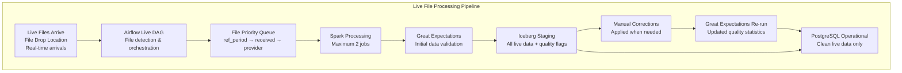
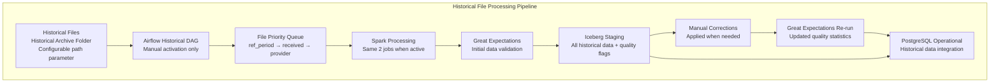
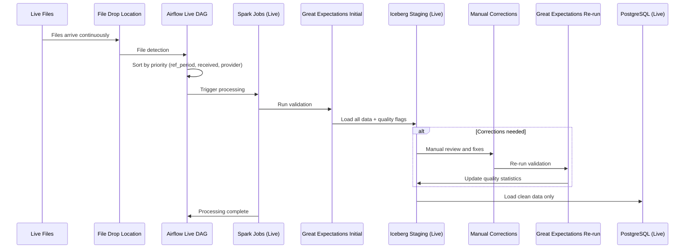
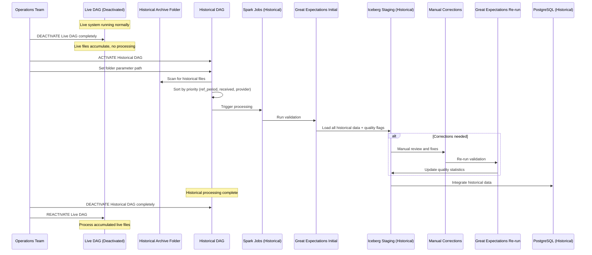
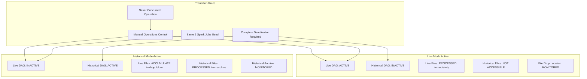
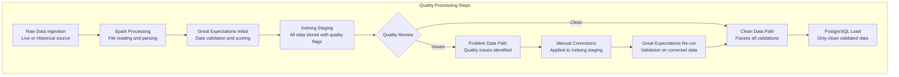

# Credit Bureau Template - Corrected Data Flow Diagrams v1.0

## Overview
Two completely independent processing systems that operate exclusively. Each system has its own data sources, processing pipeline, and operates independently with no overlap.

## 1. Live Processing System (Default Active Mode)

## 2. Historical Processing System (Manual Activation Mode)

## 3. Live Processing Detailed Sequence

## 4. Historical Processing Detailed Sequence

## 5. Exclusive Mode Operation Rules

## 6. Data Quality and Corrections Flow

## System Operation Summary

### **Live Processing System Characteristics**
- **Data Source**: File drop location (real-time file arrivals)
- **Activation**: Default active mode during business hours
- **File Processing**: Immediate processing by universal priority
- **Quality Control**: Great Expectations validation → Iceberg staging → Manual corrections → PostgreSQL
- **Resource Usage**: Up to 2 Spark jobs available

### **Historical Processing System Characteristics**
- **Data Source**: Historical archive folder (configurable path parameter)
- **Activation**: Manual activation only (typically after-hours)
- **File Processing**: Batch processing by universal priority
- **Quality Control**: Same quality flow as live system
- **Resource Usage**: Same 2 Spark jobs when system is active

### **Exclusive Operation Rules**
1. **Single Active System**: Only Live OR Historical can be active, never both
2. **Complete Deactivation**: Inactive system is completely turned off
3. **File Accumulation**: Live files accumulate during historical processing
4. **Manual Control**: Operations team manually switches between modes
5. **Resource Sharing**: Same infrastructure used exclusively by active system

### **Universal Priority Logic** (Applied to Both Systems)
- **Primary**: Reference Period (YYYYMM)
- **Secondary**: Received Timestamp
- **Tertiary**: Provider Code (tie-breaker)
- **Result**: Chronological data processing regardless of file arrival order

### **Quality Assurance Process** (Both Systems)
1. **Initial Validation**: Great Expectations on raw data
2. **Staging**: All data loaded to Iceberg with quality flags
3. **Manual Review**: Corrections applied when quality issues found
4. **Re-validation**: Great Expectations re-run on corrected data
5. **Operational Load**: Only clean, validated data goes to PostgreSQL

---

**Data Flow Version**: 1.0 (Corrected and Independent)  
**Key Principle**: Two completely separate, exclusively operating systems  
**Quality Focus**: Staging-first with mandatory quality validation