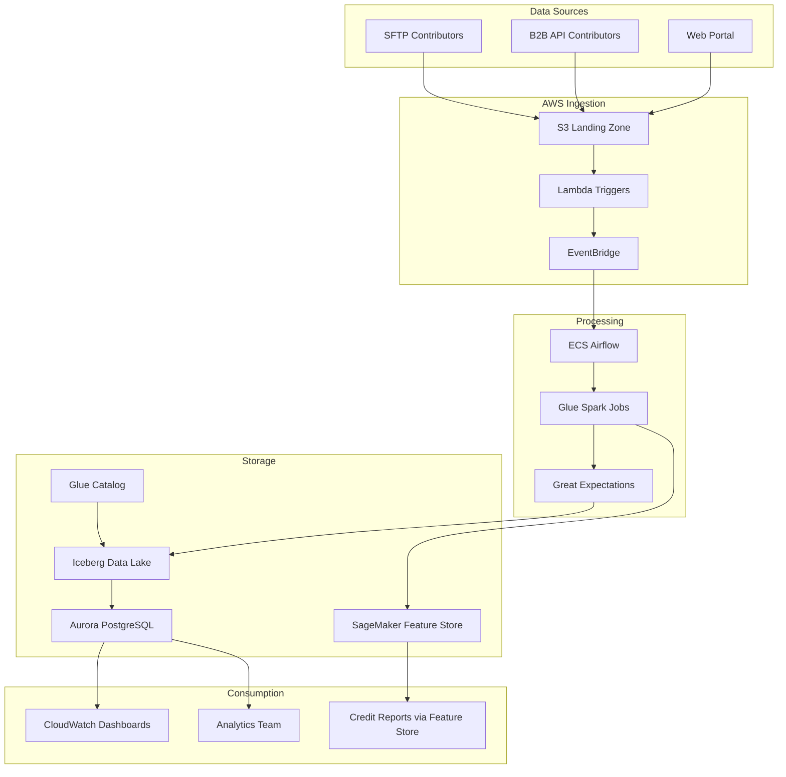

# CTOS eTR+ Technical Assessment Document - Revised

## Executive Summary
Updated technical evaluation incorporating architectural decisions for rebuilding the CTOS eTR+ platform on AWS to support 5x data growth and regulatory compliance requirements. This assessment reflects the finalized technology stack and implementation approach.

## Current Infrastructure Analysis

### Existing System Architecture
- **Platform**: On-premise server with memory-intensive pandas processing
- **Database**: MySQL with 143 tables (only 4 are final operational tables)
- **Processing**: Python-based ETL with individual contributor-specific transformations
- **Data Validation**: Great Expectations framework (limited implementation)
- **File Handling**: SFTP-based ingestion with local file storage
- **Exception Management**: Manual Teams/JIRA integration for quality issues

### Current Performance Characteristics
- **Monthly Volume**: ~700K records from 35 contributors
- **Processing Capacity**: At maximum limits with current infrastructure
- **Memory Usage**: Memory-intensive pandas operations causing bottlenecks
- **Scalability**: Cannot handle projected 5x growth (2.8-3.5M records)
- **Architecture Debt**: 143 database tables indicate over-engineered solution

### Infrastructure Limitations
- **Single Point of Failure**: On-premise server with no redundancy
- **Memory Constraints**: Pandas processing limited by server RAM capacity
- **No Environment Separation**: Lack of UAT/production isolation
- **Manual Operations**: High operational overhead requiring analyst intervention
- **Limited Monitoring**: Insufficient observability for production operations

## Target AWS Architecture - Finalized

### Selected Technology Stack
```yaml
Orchestration:
  service: Amazon ECS with Fargate
  technology: Self-managed Apache Airflow
  rationale: Cost-efficient, AWS-native containers, balanced complexity
  
Processing:
  service: AWS Glue
  technology: Serverless Spark with auto-scaling
  rationale: Handles 5x growth, managed infrastructure, Great Expectations integration
  
Data Lake:
  storage: Amazon S3
  table_format: Apache Iceberg with Glue Catalog
  rationale: ACID transactions, schema evolution, audit capabilities
  
Operational Database:
  service: Amazon Aurora PostgreSQL
  rationale: 99.99% SLA, 3x performance, automatic failover
  
Attribute Engine:
  service: Amazon SageMaker Feature Store
  rationale: Managed feature engineering, dual storage, faster delivery vs custom development
  
Quality Framework:
  service: Great Expectations on AWS Glue
  monitoring: Amazon CloudWatch with custom dashboards
  rationale: Existing team knowledge, AWS integration
  
Security:
  encryption: AWS KMS for data encryption
  access: IAM roles with least privilege
  network: VPC with private subnets
  rationale: Malaysia compliance, managed security services
```

### Architecture Components

#### Data Ingestion Layer
- **Amazon S3**: Landing zone for contributor files with event-driven processing
- **AWS Transfer Family**: Managed SFTP service replacing on-premise solution
- **Amazon API Gateway**: REST API endpoints for B2B contributor submissions
- **AWS Lambda**: File detection and processing triggers
- **Amazon EventBridge**: Event routing for processing orchestration

#### Processing Layer
- **Amazon ECS with Fargate**: Self-managed Airflow for workflow orchestration
- **AWS Glue**: Serverless Spark processing for distributed data transformation
- **Apache Iceberg**: ACID-compliant table format for data lake operations
- **Great Expectations**: Data quality validation framework
- **SageMaker Feature Store**: Managed attribute engine for calculated characteristics

#### Storage Layer
- **Amazon S3**: Multi-tier storage with intelligent tiering
- **Amazon Aurora PostgreSQL**: Operational database for real-time queries
- **AWS Glue Data Catalog**: Centralized metadata management
- **SageMaker Feature Store**: Online/offline feature storage for attribute calculations

#### Monitoring and Operations
- **Amazon CloudWatch**: Metrics, logs, and alarming
- **AWS X-Ray**: Distributed tracing for performance optimization
- **Amazon QuickSight**: Business intelligence dashboards
- **AWS Systems Manager**: Configuration and patch management

## Capacity Planning and Performance

### Data Volume Projections
```yaml
Current State:
  contributors: 35 entities
  monthly_records: 700,000
  top_9_contributors: 91% of volume
  largest_contributor: 38% (JCL)
  
Projected Growth (CCA 2025 Impact):
  contributors: 70 entities (2x growth)
  monthly_records: 2,800,000 - 3,500,000 (4-5x growth)
  processing_requirements: Must handle peak volume spikes
  
File Characteristics:
  current_average_size: 1-10 MB
  projected_max_size: Determined by contributor growth patterns
  daily_files: 50-70 files projected
  format: Pipe-delimited text (41 columns)
```

### AWS Service Sizing

#### Compute Resources
```yaml
AWS Glue:
  worker_type: G.1X (4 vCPU, 16 GB memory)
  min_workers: 2
  max_workers: 20
  auto_scaling: Enabled based on workload
  estimated_cost: $1,200/month for 5x volume
  
Amazon ECS (Airflow):
  fargate_tasks: Scheduler + webserver + 2-4 workers
  task_memory: 2GB-4GB per component
  auto_scaling: Based on DAG execution load
  estimated_cost: $320/month average
  
SageMaker Feature Store:
  online_store: Real-time feature retrieval
  offline_store: S3-based historical features
  operations_cost: $0.0035 per 1,000 reads/writes
  estimated_cost: $300/month for projected usage
```

#### Storage Requirements
```yaml
Amazon S3:
  landing_zone: 100 GB monthly intake
  processed_data: 500 GB monthly (with compression)
  retention: 7 years for compliance
  lifecycle_management: Intelligent tiering enabled
  estimated_cost: $150/month including lifecycle
  
Amazon Aurora PostgreSQL:
  instance_class: r6g.large (2 vCPU, 16 GB RAM)
  storage: Auto-scaling 10GB-128TB
  backup_retention: 30 days
  multi_az: Enabled for high availability
  estimated_cost: $200/month
  
SageMaker Feature Store:
  online_store: DynamoDB-backed for real-time access
  offline_store: S3 parquet files
  retention: Configurable by feature group
  estimated_cost: Included in $300/month operations cost
```

### Performance Targets
- **File Processing**: 99% of files processed within 30 minutes of arrival
- **Daily Batch**: Complete daily processing within 4-hour window
- **Quality Validation**: 95% of quality checks completed within 10 minutes
- **Attribute Calculations**: Sub-second response for real-time enquiries
- **Dashboard Refresh**: Operational dashboards updated within 15 minutes

## Security and Compliance Architecture

### Data Protection
```yaml
Encryption:
  at_rest: AWS KMS with customer-managed keys
  in_transit: TLS 1.2 minimum for all communications
  key_rotation: Annual automatic rotation
  feature_store: Encrypted online and offline stores
  
Access Control:
  authentication: AWS IAM with MFA requirements
  authorization: Role-based access with least privilege
  audit_logging: AWS CloudTrail for all API calls
  data_access: Detailed logging in CloudWatch
  
Network Security:
  vpc_isolation: Private subnets for all processing
  security_groups: Restrictive ingress/egress rules
  nacls: Additional network-level protection
  endpoints: VPC endpoints for AWS service communication
```

### Compliance Requirements
- **Data Residency**: All data processing within AWS ap-southeast-1 (Malaysia)
- **Audit Trail**: Complete audit logs for 7 years retention
- **GDPR Compliance**: Personal data handling and right-to-erasure capabilities
- **Financial Regulations**: Malaysian financial services compliance
- **SOC 2 Type II**: AWS services provide SOC 2 compliance

### Disaster Recovery and Business Continuity
```yaml
Backup Strategy:
  rpo: 4 hours (Recovery Point Objective)
  rto: 2 hours (Recovery Time Objective)
  s3_replication: Cross-region replication to ap-southeast-3
  aurora_backups: Automated backups with point-in-time recovery
  feature_store: Built-in durability across multiple AZs
  
High Availability:
  multi_az: Aurora and Feature Store deployed across availability zones
  auto_scaling: Compute resources scale based on demand
  health_checks: Automated monitoring with failover
  load_balancing: Application Load Balancer for API endpoints
```

## Integration Architecture

### Data Flow Architecture


### External System Integration
- **JIRA Integration**: AWS Lambda functions for exception management
- **Contributor Systems**: SFTP and API connectivity maintained
- **Analytics Tools**: Standard SQL connectivity to Aurora PostgreSQL
- **Attribute Engine**: SageMaker Feature Store for calculated characteristics
- **Monitoring Systems**: CloudWatch integration with existing operational tools

## Technology Assessment

### AWS Service Selection Rationale

#### Amazon ECS with Airflow (Selected)
- **Pros**: Cost-efficient ($320/month), AWS-native containers, balanced complexity
- **Cons**: 1-2 weeks setup, requires container knowledge
- **Decision**: Selected for cost optimization while maintaining control

#### AWS Glue (Selected)
- **Pros**: Serverless, auto-scaling, built-in data catalog integration, Great Expectations support
- **Cons**: Cold start latency, limited debugging capabilities compared to EMR
- **Decision**: Selected for distributed processing requirements and operational simplicity

#### SageMaker Feature Store (Selected)
- **Pros**: Managed infrastructure, dual storage, audit trails, faster delivery than custom development
- **Cons**: Higher operational cost than custom solution, learning curve
- **Decision**: Selected over 6-9 month DeepCredit custom development for timeline alignment

#### Aurora PostgreSQL (Selected)
- **Pros**: 99.99% SLA, 3x performance improvement, automatic failover
- **Cons**: 2x cost of RDS PostgreSQL, Aurora-specific features
- **Decision**: Selected for operational queries and attribute engine performance requirements

### Alternative Considerations Rejected
- **Amazon MWAA**: Higher cost than ECS Airflow, plugin limitations
- **EMR Clusters**: Higher operational complexity, not justified for current requirements
- **Custom DeepCredit Solution**: 6-9 month development timeline conflicts with CCA 2025 deadline
- **RDS PostgreSQL**: Insufficient performance for attribute engine requirements

## Risk Assessment

### Technical Risks

#### Medium Risk
- **Learning Curve**: Team unfamiliarity with ECS and SageMaker Feature Store
  - *Mitigation*: 1-2 weeks training period, gradual implementation approach
- **Performance Under Scale**: Untested performance at 5x volume
  - *Mitigation*: Load testing and gradual volume increase

#### Low Risk
- **AWS Service Limits**: Potential throttling at high volumes
  - *Mitigation*: Service limit monitoring and proactive increases
- **Cost Overrun**: AWS costs higher than projected
  - *Mitigation*: Cost monitoring and optimization practices
- **Integration Complexity**: SageMaker Feature Store integration challenges
  - *Mitigation*: Pilot implementation with subset of features

### Operational Risks
- **Container Orchestration**: ECS operational complexity vs MWAA
  - *Mitigation*: Comprehensive training and documentation
- **Feature Store Adoption**: Team adaptation to managed feature engineering
  - *Mitigation*: Gradual migration from existing attribute calculations

## Cost Analysis

### AWS Infrastructure Costs (Monthly Estimates - Updated)
```yaml
Compute Services:
  ecs_airflow: $320 (Fargate tasks for Airflow components)
  glue_processing: $1,200 (based on 5x volume projection)
  lambda_executions: $50 (file processing triggers)
  
Storage Services:
  s3_storage: $150 (including intelligent tiering)
  aurora_postgresql: $200 (r6g.large with Multi-AZ)
  backup_storage: $100 (automated backups and snapshots)
  
Feature Engineering:
  sagemaker_feature_store: $300 (online/offline operations)
  
Network and Security:
  data_transfer: $50 (within region transfers optimized)
  kms_operations: $20 (encryption key operations)
  cloudwatch_logs: $100 (comprehensive logging and monitoring)
  
Total Monthly: $2,270 (estimated at 5x volume)
Current Infrastructure: $2,000 (estimated on-premise costs)
Cost Increase: 14% for 5x capacity, managed services, and enhanced capabilities
```

### Cost Optimization Strategies
- **S3 Intelligent Tiering**: Automatic cost optimization for infrequently accessed data
- **ECS Fargate**: Pay only for actual task execution time
- **Feature Store Optimization**: Strategic online vs offline storage decisions
- **Aurora Reserved Instances**: Commit to instances for predictable workloads

## Implementation Roadmap

### Phase 1: Foundation (Months 1-3)
- AWS account setup and security configuration
- VPC and networking infrastructure deployment
- ECS cluster setup and Airflow deployment
- Core services deployment (S3, Glue, Aurora)
- Basic data ingestion pipeline development

### Phase 2: Core Processing (Months 4-6)
- Complete ETL pipeline development with Glue
- SageMaker Feature Store setup and integration
- Great Expectations quality framework implementation
- Operational dashboard development
- Contributor migration and testing

### Phase 3: Production Launch (Months 7-9)
- Production environment deployment
- Parallel running with existing system
- Complete contributor migration and attribute engine migration
- Operations training and documentation
- Go-live and monitoring setup

### Development Prerequisites
- **AWS Account**: Organization account with appropriate service limits
- **Team Training**: ECS containers, SageMaker Feature Store, and Glue optimization
- **Development Environment**: Sandbox environment for testing and validation
- **Security Approval**: Information security review and approval

## Monitoring and Observability

### Key Performance Indicators
```yaml
System Performance:
  - File processing latency (target: <30 minutes)
  - Daily batch completion time (target: <4 hours)
  - System availability (target: 99.5%)
  - Attribute calculation response time (target: <1 second)
  
Data Quality:
  - Quality check pass rate (target: >95%)
  - Data validation coverage (target: 100%)
  - Exception resolution time (target: <24 hours)
  - Manual intervention rate (target: significant reduction)
  
Business Metrics:
  - Contributor onboarding time (target: <2 weeks)
  - Record processing accuracy (target: 99.9%)
  - Compliance audit success rate (target: 100%)
  - Cost per record processed (target: optimized efficiency)
  
Feature Store Metrics:
  - Feature calculation latency (target: <1 second online)
  - Feature accuracy (target: 99.9%)
  - Feature reuse rate (target: >80% for common calculations)
  - Batch feature processing time (target: <2 hours daily)
```

### Alerting Strategy
- **Critical Alerts**: System failures, data loss, security breaches, feature store unavailability
- **Warning Alerts**: Performance degradation, quality threshold breaches, cost anomalies
- **Informational**: Successful processing, daily summaries, feature store usage metrics
- **Escalation**: Automated escalation for unresolved critical alerts

## Recommendations

### Immediate Actions (Pre-Phase 1)
1. **AWS Account Setup**: Establish organizational AWS account with appropriate billing and service limits
2. **Team Training**: Begin ECS, SageMaker Feature Store, and cloud operations training for development team
3. **Proof of Concept**: Develop small-scale POC to validate ECS Airflow and Feature Store integration
4. **Security Review**: Conduct information security assessment of proposed architecture

### Success Factors
1. **Executive Support**: Ensure consistent leadership backing for cloud transformation
2. **Change Management**: Invest in user training and adoption support for Feature Store
3. **Iterative Approach**: Use agile development with frequent validation checkpoints
4. **Monitoring First**: Implement comprehensive monitoring from day one

### Long-term Evolution
1. **Advanced Analytics**: Leverage SageMaker ML capabilities for predictive features
2. **Real-time Processing**: Evaluate Kinesis for near real-time data processing
3. **API Expansion**: Develop comprehensive API suite for external integrations
4. **Multi-region**: Consider multi-region deployment for disaster recovery

---

**Assessment Owner**: CTOS Technical Architecture Team  
**Assessment Date**: July 2025 (Revised)  
**Review Frequency**: Monthly during implementation  
**Next Review**: End of Phase 1 completion